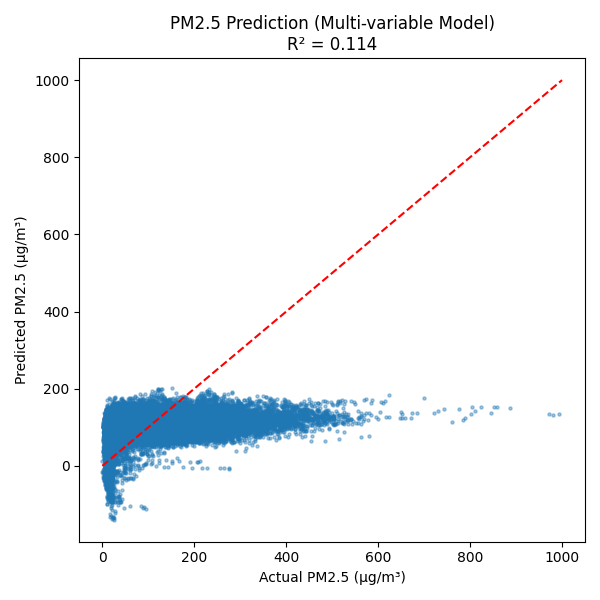
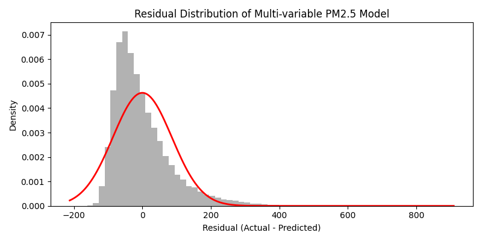
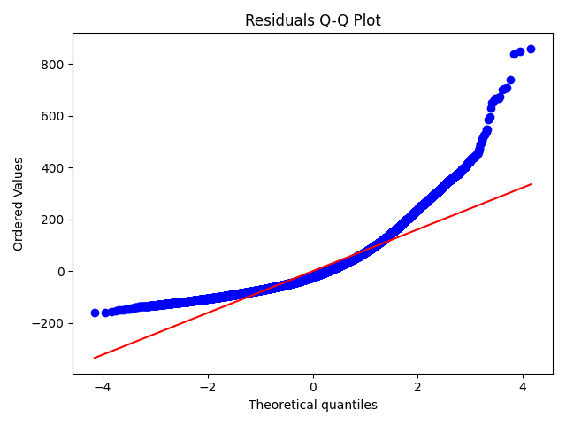

# Air Quality Portfolio Project (Beijing 2010–2014)

**项目说明 / Bilingual Project README**

---

## Overview | 项目概述

This project analyzes the **Beijing air quality dataset (2010–2014)** using Python scientific computing tools.  
The workflow covers **data cleaning**, **exploratory analysis**, **visualization**, and **statistical modeling** of PM2.5 concentrations.

本项目基于 Python 科学计算生态（NumPy / Pandas / SciPy / Matplotlib），  
对北京 2010–2014 年的空气质量数据进行 **清洗、探索、可视化与模型拟合分析**，  
完整展示从原始数据到建模结论的分析过程。

---

## Project Structure | 项目结构

```
air-quality-portfolio/
│
├── data/
│   ├── raw/               # 原始数据（UCI PRSA dataset）
│   └── cleaned/           # 清洗后的数据文件
│
├── notebooks/
│   ├── AirQuality_Report_CNfont.ipynb   # 分析报告
│
├── src/
│   ├── test_data_cleaning.py       # 时间索引与清洗步骤
│   ├── check_missing.py            # 缺失值与异常检测
│   ├── analysis_basic.py           # 描述统计分析
│   ├── visualization_pm25.py       # 时间序列与趋势图
│   ├── model_diagnostics.py       # 拟合结果图与数据
│   ├── modeling_pm25_multivar.py   # 多变量线性回归建模
│   ├── modeling_pm25_quadtemp.py   # 二次温度项回归模型
│
├── README.md
└── requirements.txt  
```

---

## Dependencies | 环境依赖

Python 版本：`>=3.9`

主要依赖库：
```bash
pip install numpy pandas scipy matplotlib jupyter
```

---

## Usage | 使用方法

### 数据准备
```bash
python src/test.py
```
自动从 [UCI Machine Learning Repository](https://archive.ics.uci.edu/ml/machine-learning-databases/00381/PRSA_data_2010.1.1-2014.12.31.csv) 下载原始数据  
并保存到 `data/raw/` 目录下。

### 数据清洗与检查
```bash
python src/test_data_cleaning.py
python src/check_missing.py
```

### 探索性分析与可视化
```bash
python src/analysis_basic.py
python src/visualization_pm25.py
```

### 模型拟合
```bash
python src/modeling_pm25_multivar.py
python src/modeling_pm25_quadtemp.py
```

### 打开 Notebook 报告
推荐直接运行：
```bash
jupyter notebook notebooks/AirQuality_Report_CNfont.ipynb
```
该 Notebook 已自动设置中文字体。

---

## Results | 分析结果

| 模型 | 主要变量 | R² |
|------|-----------|----|
| 多变量线性模型 | 温度 (TEMP)、气压 (PRES)、风速 (Iws) | **0.1141** |
| 二次温度模型 | TEMP, TEMP², PRES, Iws | **0.1154** |

模型结果表明：
- PM2.5 与温度、气压、风速均呈负相关；
- 引入温度二次项后模型略有提升；
- 数据存在较强非线性与季节性，可考虑机器学习方法进一步提升性能。

---

## Example Plots | 图表示例





---

## Next Steps | 后续方向

- 对比不同季节的回归模型；
- 引入湿度、风向等气象因素；
- 尝试 **随机森林 / XGBoost / LSTM** 等机器学习模型；
- 进一步封装为 API 或交互式可视化 Dash 应用。

---

## Author | 作者

**edg663**  
WHL Based in 🇨🇦

---

## License | 许可协议

This project is for **educational and portfolio purposes**.  
Copyright © 2025 edg663.  
All rights reserved.
