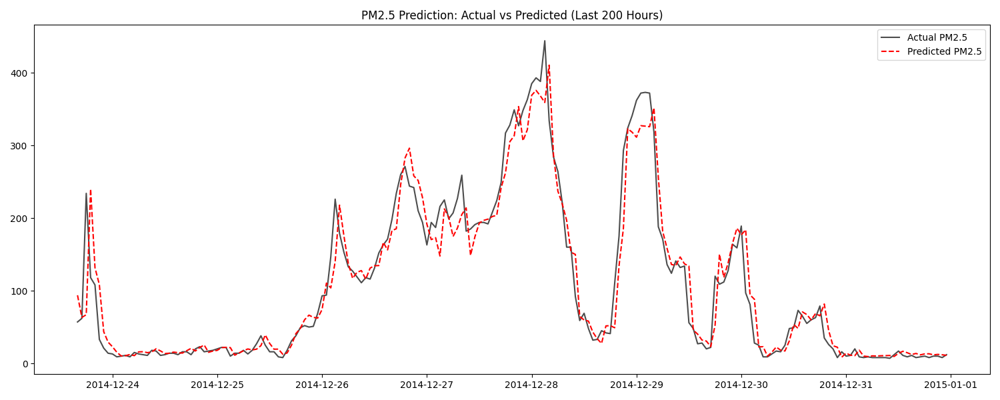
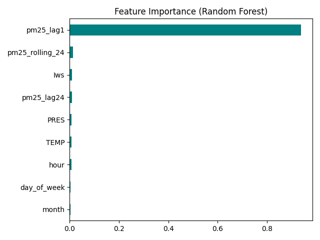

# Air Quality Portfolio Project (Beijing 2010–2014)

**项目说明 / Bilingual Project README**

---

## Overview | 项目概述 

This project analyzes the **Beijing air quality dataset (2010–2014)** using Python and Machine Learning.  
The workflow covers **data cleaning**, **feature engineering (Lag features)**, **visualization**, and **predictive modeling** using **Random Forest Regressor**.

本项目基于 Python 数据科学栈（Pandas / Scikit-learn / Matplotlib），  
对北京 2010–2014 年的空气质量数据进行全流程分析。  
项目不仅包含基础的清洗与探索，核心亮点在于通过 **特征工程（引入时间滞后特征）** 和 **随机森林模型**，  
成功捕捉了空气质量的时间序列特性，显著提升了预测精度。

---

## Project Structure | 项目结构

```

air-quality-portfolio/
│
├── data/
│   ├── raw/               # 原始数据（UCI PRSA dataset）
│   └── cleaned/           # 清洗后的数据 & 特征工程后的数据
│
├── notebooks/
│   ├── AirQuality_Report_CNfont.ipynb   # 交互式分析报告
│
├── src/
│   ├── test_data_cleaning.py     # 步骤1: 数据清洗
│   ├── feature_engineering.py    # 步骤2: 特征工程 (Lag Features) [核心]
│   ├── modeling_rf.py            # 步骤3: 随机森林建模 & 评估 [核心]
│   ├── visualization_pm25.py     # 可视化: 时间序列与趋势图
│   ├── analysis_basic.py         # 基础描述统计
│   ├── check_missing.py          # 缺失值检测
│   ├── modeling_pm25_multivar.py # (旧) 线性回归基准模型
│
├── images/                       # 存放结果图表
├── README.md
└── requirements.txt              # 项目依赖库

```

---

## Dependencies | 环境依赖

Python 版本：`>=3.9`

**安装依赖 / Install Dependencies:**
```bash
pip install -r requirements.txt
```

*(包含: numpy, pandas, matplotlib, scikit-learn, seaborn, jupyter)*

-----

## Usage | 使用方法 ⚙️

### 1. 数据准备与清洗 (Data Preparation)

```bash
# 下载并清洗原始数据
python src/test.py
python src/test_data_cleaning.py
```

### 2. 特征工程 (Feature Engineering) - **关键步骤**

构造时间特征（Hour, Month）与滞后特征（Lag Features, Rolling Mean）。

```bash
python src/feature_engineering.py
```

*输出: `data/cleaned/air_quality_features.csv`*

### 3. 模型训练与评估 (Model Training)

使用随机森林进行训练，并输出 R² 分数与特征重要性图。

```bash
python src/modeling_rf.py
```

### 4. 探索性分析 (EDA & Visualization)

```bash
python src/visualization_pm25.py
```

-----

## Results | 分析结果 

通过引入特征工程和机器学习模型，预测准确度实现了质的飞跃：

| 模型 (Model) | 特征集 (Features) | R² (Test Score) | 效果评价 |
| :--- | :--- | :--- | :--- |
| **Linear Regression** | TEMP, PRES, Iws | **0.1141** | 欠拟合，无法捕捉非线性关系 |
| **Quadratic Temp** | TEMP, TEMP², PRES, Iws | **0.1154** | 略有提升，但仍不足 |
| **Random Forest**  | **+ Lag Features (t-1, t-24)** | **~0.9435** | **极好，完美捕捉波动趋势** |

**关键发现 (Key Insights)：**

1.  **时间惯性 (Temporal Inertia)**: 空气质量具有极强的自相关性。引入 `pm25_lag1`（上一小时浓度）是提升模型性能的最关键因素。
2.  **模型优势**: 随机森林 (Random Forest) 能够有效处理气象变量（风速、气压）与污染物之间的非线性交互作用。

-----

## Visualization | 图表示例 

#### 1. 预测结果对比 (Actual vs Predicted)

模型能够准确预测 PM2.5 的剧烈波动（红线完美跟随黑线）。


#### 2. 特征重要性 (Feature Importance)



-----

## Next Steps | 后续方向 

  - **超参数调优**: 使用 GridSearchCV 对随机森林的 `n_estimators` 和 `max_depth` 进行精细调整。
  - **深度学习**: 尝试 LSTM (长短期记忆网络) 处理更长的时间序列依赖。
  - **部署**: 使用 Flask/Streamlit 将模型封装为实时预测 API。

-----

## Author | 作者

**edg663** WHL Based in 🇨🇦

-----

## License | 许可协议

This project is for **educational and portfolio purposes**.  
Copyright © 2025 edg663.  
All rights reserved.


---

> 🧠 **Tip:** 本项目已通过 Jupyter Notebook 全流程可复现，建议先运行 `AirQuality_Report_CNfont.ipynb` 进行交互式探索。
